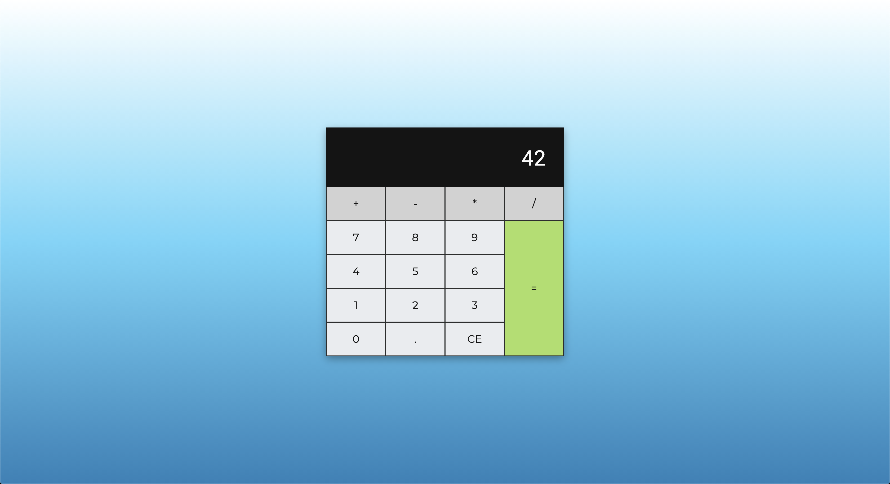

# clcltr

## Description

A super simple calculator which has the basic operators: adding, subtracting, multiplying and dividing. Also fit for smartphones.

## Learning objectives

Purely frontend objectives:

-   HTML: _dataset_
-   CSS: _Sass_, _grid_, _responsiveness_
-   JavaScript: _refactoring_, _ternary operator_
